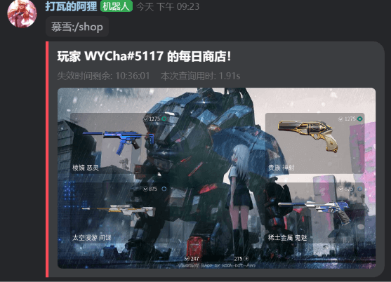
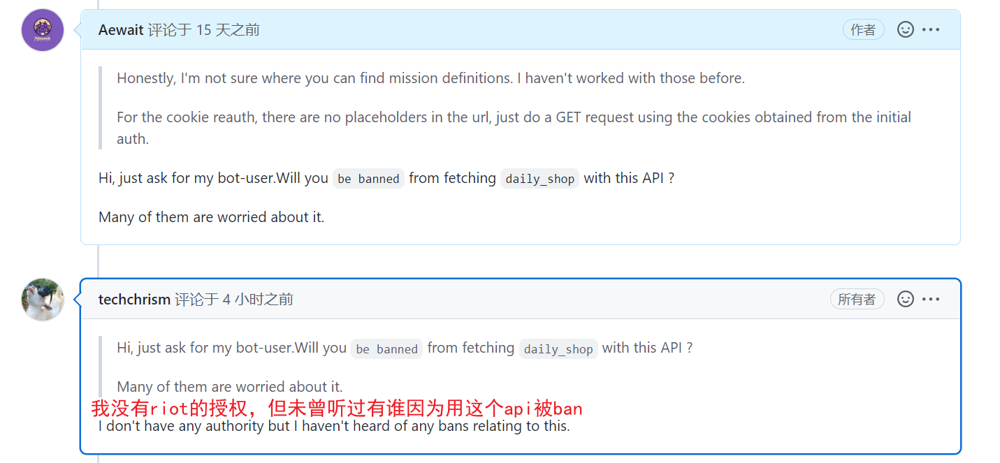

<h1 align="center">Kook-Valorant--bot</h1>

<h4 align="center">这是一个KOOK的「Valorant」小机器人</h4>

[English](./README_EN.md) | 简体中文

  
 

## 功能
当前机器人基本完善，目前支持回复Valorant游戏错误码、查询Valorant每日商店/夜市/vp/r点，和一些简单功能。邮箱验证用户登录也已添加。

下面是目前支持的功能列表：

| 帮助命令      | 功能                                       |
| ------------- | ------------------------------------------ |
| `/Ahri`           | 回复使用帮助（因`/help`和其他机器人冲突，故用阿狸的英文名`Ahri`替代） |
| `/vhelp` | Valorant相关查询功能的帮助命令                     |

| 游戏相关      | 功能                                       |
| ------------- | ------------------------------------------ |
| `/val 错误码` | 回复游戏错误码解决方法                     |
| `/saveid`     | 保存（修改）用户的游戏id                   |
| `/myid`       | 显示用户的游戏id                           |
| `/bundle 皮肤名`  | 搜索已有皮肤系列包含什么枪械               |
| `/login 账户 密码` | 私聊bot进行登录riot账户的操作(获取token) |
| `/logout` | 退出riot账户登录 |
| `/shop` | 获取每日商店的4个皮肤 |
| `/night` | 获取夜市的6个皮肤 |
| `/uinfo` 或 `/point` | 获取玩家卡面和称号，剩余vp和r点 |
| `/notify-a 皮肤名` | 搜索皮肤名，并提供选项将指定皮肤加入商店提醒 |
| `/notify-l` | 查看当前已经设置了提醒的皮肤 |
| `/notify-d 皮肤uuid` | 使用uuid删除不需要提醒的皮肤 |
|`/rate 皮肤名`|查找皮肤，选择指定皮肤进行打分|
|`/rts 序号 打分 吐槽`|选中皮肤序号，给该皮肤打个分(0~100) 再吐槽一下!|
|`/kkn`|查看昨日评分最高/最低的用户|

`/rate` 参与的打分，其会显示在 `/shop` 商店查询结果的尾部，同时统计当日商店最高分和最低分，可以在第二天用 `/kkn` 来查看。

| Vip相关     | 功能               |
| ------------- | ---------------- |
| `/vip-u 激活码` |兑换阿狸的vip |
| `/vip-c` | 查看vip的剩余时间 |
| `/vip-shop` | 查看已保存的商店查询diy背景图 |
| `/vip-shop 图片url` | 添加商店查询diy背景图  |
| `/vip-shop-s 图片编号` | 切换商店查询的背景图 |
| `/vip-shop-d 图片编号` | 删除商店查询的背景图 |

每日商店刷枪提醒功能 `/notify-a` 需要用户**保持登录状态**，bot会在每天的`08:00AM`遍历列表，查看您的商店是否刷出了您想要的皮肤；如果是vip用户，则会直接发送当日商店的图片。

cookie 登录信息将在2-3天后失效，所以皮肤提醒功能会出现用户没有登录而无法获取的情况。目前取消了notify未登录提醒，添加了在**全局变量**中保存账户密码的功能。

| 其他命令    | 功能                                                         |
| ----------------- | ------------------------------------------------------------ |
| `/hello`          | 打个招呼 (一般用来测试bot在不在线)                                                 |
| `/roll 1 100`     | 掷色子1-100，范围可自行调节                                  |
| `/countdown 秒数` | 倒计时，默认60秒                                             |
| `/TL 内容` | 翻译内容。其他语言翻译为中文，中文默认翻译成en |
| `/TLON` | 在本文字频道`打开`实时翻译功能 |
| `/TLOFF` | 在本文字频道`关闭`实时翻译功能 |
| `/we 城市` | 查询`城市`未来3天的天气情况 |
| `/hs` | 历史上的今天（因为kook审核原因被删除） |
|         `无`         | 自动给新用户上对应角色（可自主修改）                           |
| `无` | 当有人助力服务器的时候，在通知频道发送感谢信息 |

你可以在[screenshot](./screenshot)文件夹中找到对应的截图示例

 

更多截图

----

### valorant-shop-img-api

> Api源码见 [api.py](./code/api.py)
>
> Api文档见 [docs/valorant-shop-img-api.md](./docs/valorant-shop-img-api.md)

这个Api是基于aiohttp写的，主要还是复用了阿狸主代码中给商店画图的部分，支持自定义背景图，邮箱双重验证；

fork本仓库，您可以将Api部署到您的本地进行测试，或直接套用Api到您的其他语言的项目上！

Api请求返回示例图：

----

## 如何使用？

保证你的Windows/Linux中`Python`版本高于`3.8`，执行下面的安装库命令

~~~
pip install -r requirements.txt
~~~

建议根据 [khl.py/example](https://github.com/TWT233/khl.py/tree/main/example) 的教程，学习KOOK机器人的基本搭建（很简单的，相信我）

如果你想直接使用本机器人，可以转到本仓库 [WIKI](https://github.com/Aewait/Valorant-kaiheila-bot/wiki) 查看更多引导内容

----

## To Do

下面是一些未来的计划

- [x] 增加保存用户游戏id的功能
- [x] 添加自动给新用户上色功能（目前只有kook的valorant服务器能用）
- [ ] 实现查询游戏战绩（需要roit授权）
- [x] 实现玩家商店刷枪的查询
- [x] 实现当商店刷新某一把枪的时候提醒玩家
- [x] 查看玩家的夜市
- [x] 邮箱验证2fa登录
- [ ] 通行证、每日任务的查询
- [ ] 以类似抽卡的方式，用按钮、图片等等方式显示用户的夜市
- [ ] Api增加使用Riot Token调用的接口，方便本地管理登录信息，调用api画图

咳咳，虽然初步的商店查询功能已经上线，但是其是否`封号`依旧有争论！目前功能已经上线半年有余，未出现异常现象；且询问过外网开发者，其表示没有听说过有人因为使用api查询而被封号。

**如果您担心风险，请不要使用相关功能**！bot的`/vhelp`命令`/login`命令中有相关警告提示，使用即代表您同意了承担风险！

----

## 依赖

由于本人压根没有系统的学过Python，所以本仓库的很多代码都是根据他人教程修改后使用的
* 基本框架参考[khl.py](https://github.com/TWT233/khl.py)提供的  `kook sdk` 以及使用教程
* Valorant游戏皮肤/捆绑包/玩家卡面等素材源自 [valorant-api.com](https://valorant-api.com/)
* Valorant游戏主要商店查询代码基于 [ValorantClientAPI](https://github.com/HeyM1ke/ValorantClientAPI) 项目提供的 `api文档`
* 通过账户密码获取 `riot_auth_token` 基于 [floxay/python-riot-auth](https://github.com/floxay/python-riot-auth) & [Prodzify/Riot-auth](https://github.com/Prodzify/Riot-auth)

### 特别鸣谢🎁
* [@DeeChael](https://github.com/DeeChael) 帮我 debug
* [@Edint386](https://github.com/Edint386) 帮助添加了 `PIL` 代码来进行 `/shop` 的画图 
* [@staciax](https://github.com/staciax) for [Valorant-DiscordBot/issues/74](https://github.com/staciax/Valorant-DiscordBot/issues/74) & [issues/97](https://github.com/staciax/Valorant-DiscordBot/issues/97)

### 支持本项目😘

阿狸的支出主要为云服务器的费用，您的支持是对作者的最大鼓励！

<a href="https://afdian.net/a/128ahri">
    
</a >