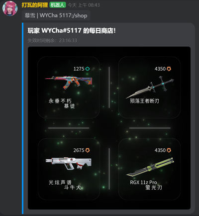
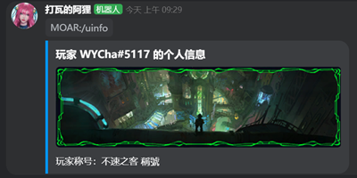
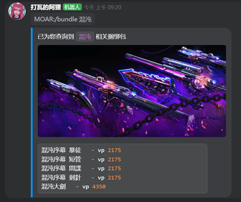
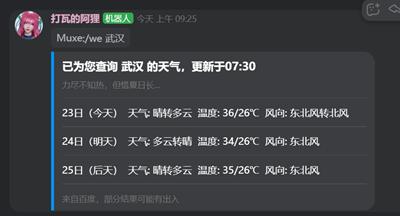
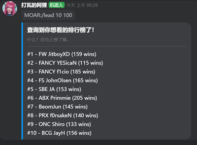
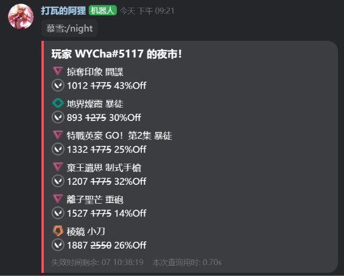

<h1 align="center">
Kook-Valorant-Bot</h1>

<h4 align="center">this is a Valorant bot for KOOK platform</h4>

English | [简体中文](./README.md)

  
 

KOOK(once called kaiheila) is a Chinese voice communication software.

>Because this bot are only used in Chinese platform,so I didn't write a more detail Readme in English.Sorry for that

## Command

Here is the Command List for bot:

| Help        | Function                                                     |
| --------------- | ------------------------------------------------------------ |
| `/Ahri`         | help command（Because `/help`conflicts with other bots, `/Ahri`is used instead,who is an hero in League of Legends） |
| `/vhelp`         | help command for Valorant serch fuction |

Recommended to use after the Valorant_Function is stable.

| Valorant        | Function                                                     |
| --------------- | ------------------------------------------------------------ |
| `/val err_code` | help with the err_code of valorant                           |
| `/saveid`       | save or change user's game ID                                |
| `/myid`         | show user's game ID                                          |
| `/bundle name`    | search for skin bundles                                            |
| `/login account passwd` | login your `riot_account` to fetch `auth_token` |
| `/logout` | logout your riot_account |
| `/shop` | fetch skin at daily shop |
| `/night` | fetch night market at daily shop |
| `/uinfo` or `/point` | fetch player `card` & `title`,remaining `Vp` and `Rp` |
| `/notify-a skin_name` |search for skin name,providing NO for add it into notification |
| `/notify-l` | show current notify skin |
|`/rate skin_name`|search skin by name for /rts|
|`/rts NO. point comment`|select skin_no. to rate a point(0~100) and leave a comment to it|
|`/kkn`|checkout yesterday's heighest/lowest rate_point of daily shop |

| Vip    | Function                |
| ------------- | ---------------- |
| `/vip-u uuid` | get vip from uuid |
| `/vip-c` | check remaining time for vip |
| `/vip-shop` | check current vip-shop background img |
| `/vip-shop img-url` | add vip-shop background img  |
| `/vip-shop-s NO.` | switch vip-shop background img using `NO.`,  `NO.` will show at `/vip-shop` |
| `/vip-shop-d NO.` | delete vip-shop background img using `NO.` |

notify function require user to stay `login`, bot wil fetch your daily shop at `08:00AM GMT+8` .If the skin is in daily shop, bot will send a private message to user.

If the user is a vip, the bot will also send the full picture of the daily-shop on that day through private message.

> The bot is only using in Chinese platform, the skin `name` only support `zh-TW`

| Other        | Function                                                     |
| --------------- | ------------------------------------------------------------ |
| `/hello`        | reply "world!"                                               |
| `/roll 1 100`   | return a number in `1~100`                                   |
| `/countdown 30` | set a countdown for 30s,which default is 60s                 |
| `/TL context`   | traslate context. from `ZH to EN` & `Other languages to ZH` |
| `/TLON`         | turn on real-time translation at current channel             |
| `/TLOFF`        | turn off real-time translation                               |
| `/we city`      | weather of the `city` in 3 days                                       |
| `/hs`           | history of today (now deleted)                                            |
| -               | Automatically grant roles to users                           |
| -               | When someone sponsor the server, send a thanks message on the notification channel |

You can find image examples for the functions in [screenshot](./screenshot) floder.

 

more screenshots

----

## How to used?

make sure your Windows/Linux `Python` version `3.8+`

~~~
pip install -r requirements.txt
~~~

It is highly recommand to checkout [khl.py/example](https://github.com/TWT233/khl.py/tree/main/example) first for basic kook bot init

If you want to use this bot, go [WIKI](https://github.com/Aewait/Valorant-kaiheila-bot/wiki) for more infomation

---

## About

Many codes in this repo are modified and used according to others' tutorials
* KOOK Bot base on [khl.py](https://github.com/TWT233/khl.py)
* Valorant Skin Api base on [valorant-api.com](https://valorant-api.com/)
* Main fetch_code base on [ValorantClientAPI](https://github.com/HeyM1ke/ValorantClientAPI)
* Fetch riot_auth_token base on [floxay/python-riot-auth](https://github.com/floxay/python-riot-auth) & [Prodzify/Riot-auth](https://github.com/Prodzify/Riot-auth)

### Special Thanks🎁
* [@DeeChael](https://github.com/DeeChael) for helping me debug
* [@Edint386](https://github.com/Edint386) for adding PIL_code for `/shop` 
* [@staciax](https://github.com/staciax) for [Valorant-DiscordBot/issues/74](https://github.com/staciax/Valorant-DiscordBot/issues/74) & [issues/97](https://github.com/staciax/Valorant-DiscordBot/issues/97)

If you like this project,please hit a star!✨