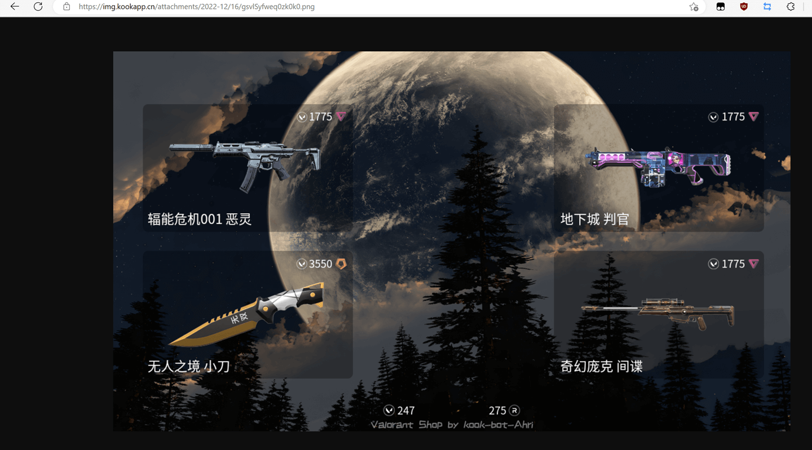
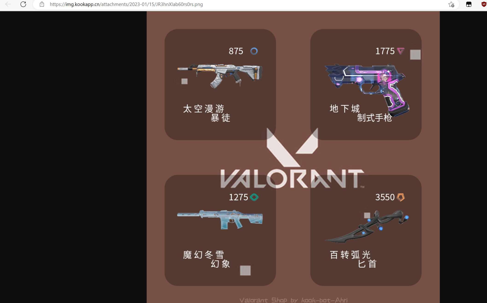

## 欢迎您使用阿狸瓦洛兰特商店Api

> Api展示页 https://val.musnow.top/
>
> Api根连接 https://val.musnow.top/api/

Api是一个网页链接，能够方便的被用户使用或被开发者调用，以实现特定功能

和阿狸机器人一样，**此api后台不会打印任何params参数**。只要链接不被攻击，你的账户密码只有你自己使用的时候看得到！很是安全

> 阿狸帮助频道有一个免费的token，加入帮助频道即可领取；有任何问题，也欢迎加入帮助频道与我交流🎶
> [kook帮助服务器邀请链接](https://kook.top/gpbTwZ)

| 接口 | 说明                  | 状态 |
| ---------- | --------------------- | -------- |
| /shop-img  | 登录，直接返回并跳转商店的图片  | 正常   |
| /shop-url  | 登录，以`json`格式返回商店图片url  | 正常   |
| /shop-draw  | 无需登录，提供4个皮肤uuid 返回图片url  | 开放测试   |
| /tfa  | 邮箱验证接口，需和`/shop-url`接口配合使用 | 正常   |


## 1.使用示例

查询每日商店的链接如下，调用`/shop-img`接口，浏览器会直接跳转图片，适合普通用户快捷查看当日每日商店

由于该接口会直接跳转到图片，所以不支持开启了邮箱验证的用户

~~~
https://val.musnow.top/api/shop-img?token=API的密钥&account=账户&passwd=密码
~~~

直接丢浏览器里面打开就行，想看商店直接用这个链接看就行辣，可以浏览器收藏一下哦！

* 添加第四个参数`&img_src=图片url`，此参数用于自定义背景图
* 添加第五个参数`&img_ratio=图片比例`，将此参数设置为`1`，代表背景图是 `1-1` 的正方形，最终的成果图也将是正方形；默认比例为 `16-9`
* 注：如果选择 `1-1` 的返回图，则图中不会带vp和rp剩余


若要添加自定义背景图，则链接应该如下
~~~
https://val.musnow.top/api/shop-img?token=API的密钥&account=账户&passwd=密码&img_src=背景图片链接
~~~

如果背景图是1-1的正方形
~~~
https://val.musnow.top/api/shop-img?token=API的密钥&account=账户&passwd=密码&img_src=背景图片链接&img_ratio=1
~~~

自定义背景图请求示例（16-9）

~~~
https://val.musnow.top/api/shop-img?token=API的密钥&account=账户&passwd=密码&img_src=https://img.kookapp.cn/assets/2022-09/KV5krdRx080qo0f0.jpg
~~~

结果示例图（16-9）



结果示例图（1-1）



## 2.注意事项

自定义背景图的url请使用国内可以直接访问的图床，如`阿里云OSS/路过图床/白嫖kook的图床`等。否则无法获取到图片链接的内容，api会报错；

> * 路过图床：https://imgse.com/
> * kook图床白嫖教程：[点我](https://img.kookapp.cn/assets/2022-12/nICYcewY8a0u00yt.png)

欢迎大家向朋友宣传此Api，但请不要恶意连续多次调用

## 3.开发者接口

由于服务器是个6m小水管，再加上刚开放的时候本地缓存不足，画图耗时长。所以响应很慢，大约12秒。所以，我估摸着也没有开发者愿意用这种慢吞吞的api吧？

好处就是后台包装了**图片处理+riot登录**，你只需要传入账户密码，剩下的交给api解决！

注：只有`code 0`才是获取正常，`200/400` 都是有错误，会返回错误的原因。

### 3.1 shop-url

如果你是开发者，请使用`/shop-url`来获取`json`格式的结果

~~~
https://val.musnow.top/api/shop-url
~~~

请求方法：`GET`

速率限制：`10r/m`

| params参数 | 说明                  | 参数类型 |是否必填 |
| ---------- | --------------------- | -------- | -------- |
| token      | API token             | string|是       |
| account    | 拳头账户              | string |是       |
| passwd     | 拳头账户密码          | string|是       |
| img_src    | 自定义背景图的url链接 | string | 否       |
| img_ratio    | 自定义背景图比例，值为1代表正方形 | string |否       |

返回示例

~~~json
{
    "code": 0, 
    "message": "https://img.kaiheila.cn/attachments/2022-10/12/1GaII87UTd0zk0k0.png", 
    "info": "商店图片获取成功"
}
~~~

### 3.2 tfa

此接口用于两步验证，适用于开启了邮箱验证的用户；

您需要先请求 `/shop-url` 接口，在用户获取到验证码后，再请求本接口

~~~
https://val.musnow.top/api/tfa
~~~

请求方法：`POST`

| params参数 | 说明                  | 参数类型 |是否必填 |
| ---------- | --------------------- | -------- | -------- |
| token      | API token             | string|是       |
| account    | 拳头账户              |string  |是       |
| vcode   | 邮箱验证码 |  string  | 是       |

返回示例

~~~json
{
    "code": 0, 
    "message": "email verify code post success,wait for shop img return", 
    "info": "两步验证码获取成功，请等待主接口返回",
    "vcode": 114514
}
~~~

### 3.3 shop-draw

这个接口更加适合在本地管理用户的登录信息，本地调用riot api获取用户`商店皮肤/vp/rp`后，再调用此接口，直接返回图片url

请求方法：`GET`

| params参数 | 说明                  | 参数类型 |是否必填 |
| ---------- | --------------------- | -------- | -------- |
| token      | API token             | string|是       |
| list_shop    | 4个皮肤uuid      | list |是       |
| vp   | vp | string | 否       |
| rp   | rp  | string | 否       |
| img_src    | 自定义背景图的url链接 | string |否       |
| img_ratio    | 自定义背景图比例，值为1代表正方形 | string |否       |

其中 `list_shop` 为riot商店返回值中的以下字段，传入 `["SkinsPanelLayout"]["SingleItemOffers"]` 即可

```json
{
  "SkinsPanelLayout":{
    "SingleItemOffers":[
       "4875e120-4d7d-aa2a-71c5-c0851c4af00d",
       "5ac106cd-45ef-a26f-2058-f382f20c64db",
       "c7695ce7-4fc9-1c79-64b3-8c8f9e21571c",
       "f35f6e13-4b7b-da38-c0de-5c91fffd584b"
    ],
    "SingleItemOffersRemainingDurationInSeconds":60193
  }
}
```

vp/rp只有16-9的图片需要，如果设置了`img_ratio`为`'1'`，则无需给予vp/rp参数

返回示例
~~~json
{
    "code": 0, 
    "message": "https://img.kaiheila.cn/attachments/2022-10/12/1GaII87UTd0zk0k0.png", 
    "info": "商店图片获取成功"
}
~~~

## 4.Python示例代码

### 示例代码1：shop-url

~~~python
import requests

url = "https://val.musnow.top/api/shop-url"
params = {
    "token":"api-token",
    "account": "拳头账户",
    "passwd": "拳头密码",
    "img-src": "https://img.kookapp.cn/assets/2022-09/KV5krdRx080qo0f0.jpg"
}
res = requests.get(url,params=params)
print(res.json())
~~~

运行即可获得商店返回结果

~~~~
{'code': 0, 'message': 'https://img.kookapp.cn/attachments/2023-01/15/mLjpR95mZ20rs0rs.png', 'info': '商店图片获取成功'}
~~~~

本地循环请求测试，非2fa用户相应时间约为`10-12s`

```
[start test]
{'code': 0, 'info': '商店图片获取成功', 'message': 'https://img.kookapp.cn/attachments/2023-02/06/6jt8l2pkxL0rs0rs.png'}
12  time:  11.670713091999914
{'code': 0, 'info': '商店图片获取成功', 'message': 'https://img.kookapp.cn/attachments/2023-02/06/6jt8l2pkxL0rs0rs.png'}
11  time:  10.637970628999938
{'code': 0, 'info': '商店图片获取成功', 'message': 'https://img.kookapp.cn/attachments/2023-02/06/6jt8l2pkxL0rs0rs.png'}
10  time:  11.477466089000018
```

### 示例代码2：shop-draw

```python
def ApiRq2(list_shop:list,background='',img_ratio='0'):
    url = "https://val.musnow.top/api/shop-draw"
    params = {
        "token":"api-token",
        "list_shop": list_shop,
        "img_src": background,
        "img_ratio": img_ratio
    }
    res = requests.get(url,params=params) # 请求api
    return res.json()

# 参数
shop = ["49cea67c-4552-13c2-6b4b-8ba07761504e","9d501eec-4084-5d44-32ef-6e8ed5b0ed49","6f2aefab-439d-140a-4dc6-87818e2d72cd","279e0a89-4dd6-b135-cef9-8ebb1df6f2ac"]
img_url = "https://img.kookapp.cn/assets/2023-01/l7Q7WQIaE40xc0xc.jpg"
res = ApiRq2(shop,img_url,'1')
print(res)
```
结果

```
{'code': 0, 'info': '商店图片获取成功', 'message': 'https://img.kookapp.cn/attachments/2023-02/03/pSMrv6vCkh0rs0rs.png'}
```

本地循环请求测试，用时约为4-5s，相对来说较友好
```
[start test]
time:  4.115649149000092
{'code': 0, 'info': '商店图片获取成功', 'message': 'https://img.kookapp.cn/attachments/2023-02/06/xgbRjMQeLQ0rs0rs.png'}
time:  4.091482147000079
{'code': 0, 'info': '商店图片获取成功', 'message': 'https://img.kookapp.cn/attachments/2023-02/06/xgbRjMQeLQ0rs0rs.png'}
time:  3.8343799629999467
{'code': 0, 'info': '商店图片获取成功', 'message': 'https://img.kookapp.cn/attachments/2023-02/06/xgbRjMQeLQ0rs0rs.png'}
time:  3.845521912999857
{'code': 0, 'info': '商店图片获取成功', 'message': 'https://img.kookapp.cn/attachments/2023-02/06/xgbRjMQeLQ0rs0rs.png'}
time:  3.9116134020000572
{'code': 0, 'info': '商店图片获取成功', 'message': 'https://img.kookapp.cn/attachments/2023-02/06/xgbRjMQeLQ0rs0rs.png'}
time:  3.822338727999977
{'code': 0, 'info': '商店图片获取成功', 'message': 'https://img.kookapp.cn/attachments/2023-02/06/xgbRjMQeLQ0rs0rs.png'}
```